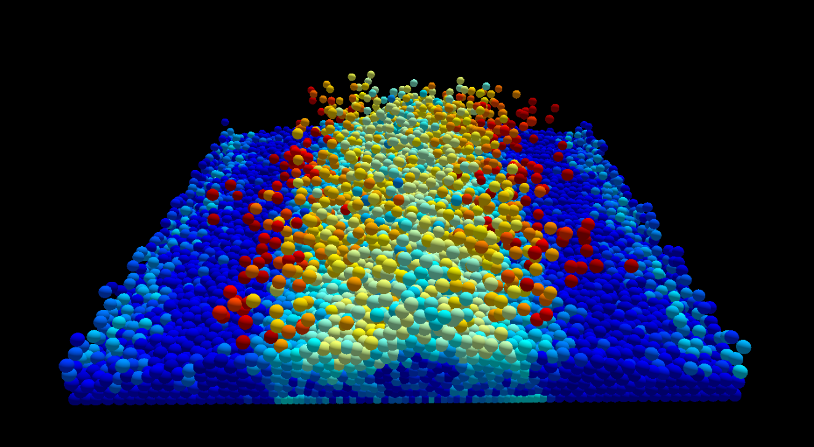
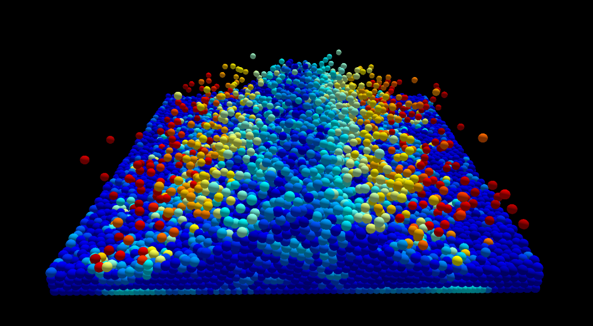
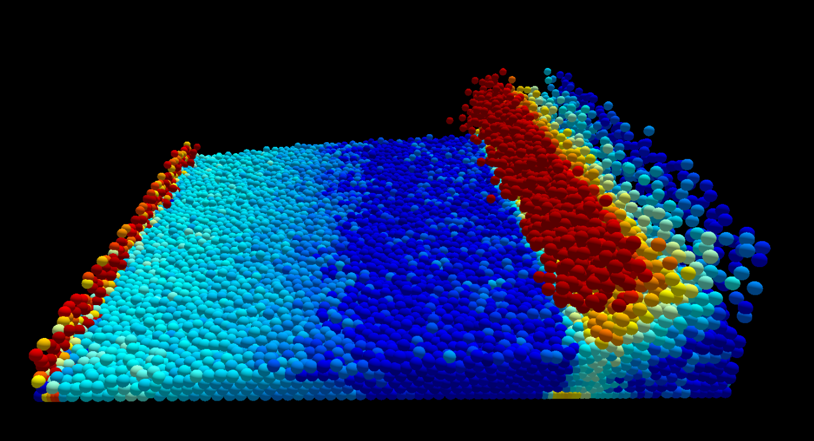
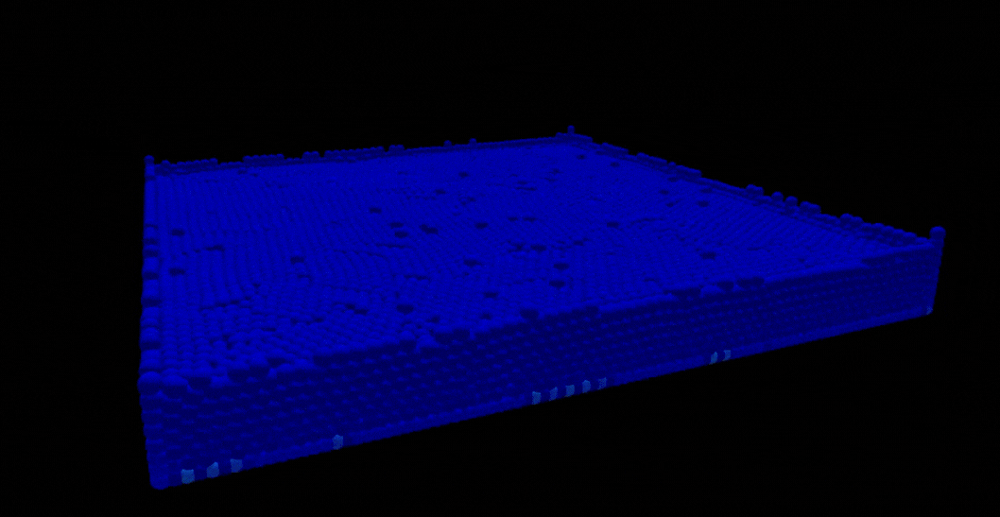

# 3D SPH Fluid Simulation

This is a simple 3D SPH (Smoothed Particle Hydrodynamics) fluid simulation that is built on the Vulkan API.

All simulations steps are done through compute shaders and renderering is done through fragment and vertex shaders.

## Preview

## DEMO

Demo showing 35000 particles running smoothly.

## Requirements
To build the project, you will need
- Vulkan SDK
- Cmake
- A compiler with C++20 support
- Linux OS

CMake is currently not configured to support Windows OS and is only made to work with Linux.

## Progression
- [x] SPH simulation in 3D.
- [x] Transfer simulation steps to compute shaders on the GPU.
- [x] Dynamic boundary
- [ ] Boundary Gizmo
- [ ] Implement GJK collision detection
- [ ] Implement EPA collision resolution
- [ ] Custom object particle initalisation
- [ ] Custom object boundary
- [ ] Particle Portals
- [ ] Sky box

